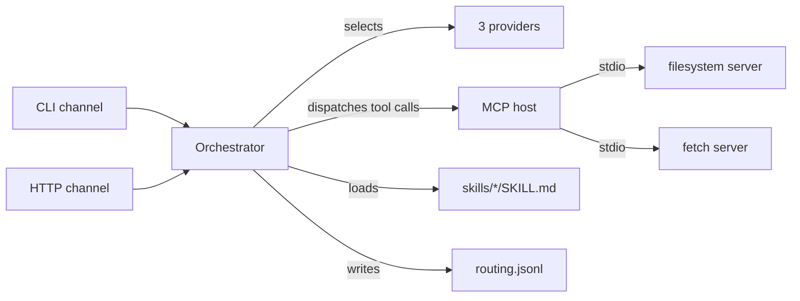

# ferryman

> A local-first MCP host with pluggable skills, multi-provider routing, and
> multi-channel I/O. The gateway, not the IDE.

[](.github/workflows/ci.yml)
[](LICENSE)
[](https://kotlinlang.org)

ferryman sits one level above Claude Code: instead of being the IDE, it is the
gateway that connects MCP servers, routes requests across LLM providers, and
exposes skills (the [Agent Skills](https://agentskills.io) open standard) over
multiple channels (CLI and HTTP). It is a small, honest, well-architected
gateway — a portfolio piece, not a product.

> **Host, not server.** ferryman is an MCP *host*: it connects **to** MCP
> servers (filesystem, fetch) as a client and aggregates their tools. It does
> not expose itself **as** an MCP server — you cannot point an LLM's MCP config
> at it and discover tools. An LLM reaches ferryman through its own channels
> instead: shell out to `ferry run <skill>`, or `POST /invoke` against
> `ferry serve`. (Exposing ferryman-as-server is a real gap, not a config flag.)

## Get a fit summary for a role

The primary use case: research a company's engineering fit for a mobile-engineer
candidate. Give it a company and a role, and ferryman fetches real data from the
web and reports on tech stack, remote policy, AI posture, and mobile-first
orientation — with sources cited.

```bash
git clone https://github.com/ber4444/ferryman-mcp && cd ferryman-mcp
./gradlew build && ./gradlew installDist

export ZAI_API_KEY=...        # or GEMINI_API_KEY=...

./build/install/ferry/bin/ferry run company-role-research \
  --input '{"company":"EarnIn","role":"Senior Mobile Engineer (Android)"}'
```

Output (abbreviated):

```
**Tech stack:** EarnIn's Android app uses Jetpack Compose and Kotlin
Multiplatform for shared logic (per their engineering blog).
**Remote policy:** Remote-friendly for mobile engineers.
**SF Bay Area:** HQ in Palo Alto; hybrid optional.
**AI posture:** Not AI-native — fintech/earnings-access product.
**Mobile-first:** Yes — mobile is the primary product surface.
**Sources:** https://earnin.com/careers, https://earnin.com/eng/blog
```

Switch providers to compare:

```bash
# Same query, different model — routes through Gemini instead of z.ai GLM
./build/install/ferry/bin/ferry run company-role-research \
  --provider gemini \
  --input '{"company":"EarnIn","role":"Senior Mobile Engineer (Android)"}'
```

## Feature status

Every row maps to a runnable command. Nothing is marked `done` until that
command passes on `main`.

| Capability | Status | Proof command |
|---|---|---|
| Build, lint, test | done | `./gradlew build` (28 Kotlin tests, ktlint, detekt) |
| CLI launcher | done | `./gradlew installDist` → `build/install/ferry/bin/ferry` |
| Provider routing (3 providers) | done | `ferry providers list` — zai-glm, gemini, hf-llama |
| Skills enumerable | done | `ferry skills list` — company-role-research, hello-repo |
| MCP host aggregates tools | done | `ferry tools list` — filesystem + fetch MCP servers |
| Fit summary | done | `ferry run company-role-research --input '{"company":"...","role":"..."}'` |
| HTTP channel | building | `ferry serve --port 8080` (needs an API key) |
| Routing logged | done | unit-tested; `logs/routing.jsonl` written by every `runSkill` call |
| Python eval harness | done | `python -m pytest eval_harness/ -q` (31 tests green) |
| Multi-provider scorecard | partial | zai-glm 66% + hf-llama 81% (fixed scorer); gemini re-run pending — see [Scorecard status](#scorecard-status) |

## Scorecard status

The harness has run against live providers (2026-07-15). After fixing a scorer
bug (see below), two of three providers have real baselines; gemini is not yet
measured:

| Provider | Rule pass (fixed scorer) | Mean latency | Mean cost (est.) | Status |
|---|---|---|---|---|
| zai-glm | **66%** | 29 s | $0.0014 | real baseline (59 cases incl. 7 errors) |
| hf-llama | **81%** | 8.8 s | $0.0002 | real baseline (59/59 produced output) |
| gemini | — | — | — | all 59 returned HTTP **429** (rate limited) — re-run pending |

**Scorer bug, now fixed.** The positive-presence scorers matched the concept
word anywhere in the output, so *"No public evidence of Jetpack Compose"*
counted as a pass for `usesJetpackCompose`. This inflated every provider whose
output honestly declines. `_positive_presence` is now negation-aware (a match
preceded by "no evidence of…" no longer counts); the numbers above are
re-scored from raw JSON with the fix. Impact: hf-llama 94%→81% (38 false
passes removed), zai-glm 69%→66% (9 removed). The bug punished the *more*
honest model hardest — llama's frequent "no public evidence of…" declines were
being counted as affirmations.

gemini's recorded "23%" is a separate artifact: rule scorers matching incidental
tokens in 429 error text against a provider that emitted no output. It needs a
re-run under a non-rate-limited key before it belongs in the matrix.

## Quickstart

```bash
git clone https://github.com/ber4444/ferryman-mcp && cd ferryman-mcp

# Build the host and CLI
./gradlew build
./gradlew installDist

# Set at least one provider key (both are optional, but you need one to run a skill)
export ZAI_API_KEY=...        # z.ai GLM (default provider)
export GEMINI_API_KEY=...     # Google Gemini

# List configured providers and skills
./build/install/ferry/bin/ferry providers list
./build/install/ferry/bin/ferry skills list

# Get a fit summary for a role
./build/install/ferry/bin/ferry run company-role-research \
  --input '{"company":"EarnIn","role":"Senior Mobile Engineer (Android)"}'
```

## Running the eval harness

The harness scores the `company-role-research` skill against a 59-case golden set
(58 real companies + 1 fabricated "Acme Holdings" negative case). It supports two
invocation modes:

**Via subprocess (finds the Gradle-installed binary automatically):**

```bash
python3 -m venv .venv && source .venv/bin/activate
pip install -e '.[dev]'
python eval_harness/run_scorecard.py --all-providers
```

**Via HTTP (start the server first, then point the harness at it):**

```bash
# Terminal 1 — start the ferry HTTP channel
./build/install/ferry/bin/ferry serve --port 8080 &

# Terminal 2 — run the scorecard (auto-detects HTTP, falls back to subprocess)
python eval_harness/run_scorecard.py --all-providers
```

The scorecard writes `eval_harness/scorecard.md` (human-readable) and
`eval_harness/scorecard.json` (machine-readable) with real numbers from real
invocations — no fabricated results.

To run the judge layer (requires a separate `JUDGE_API_KEY`):

```bash
JUDGE_API_KEY=... python eval_harness/run_scorecard.py --all-providers --judge
```

### Troubleshooting

- **`McpException: Connection closed`** — an MCP server failed to start. The
  `fetch` server requires `mcp-server-fetch` installed in the `.venv`
  (`pip install -e .` pulls it in as a dependency). Run `ferry tools list` to
  verify both servers start cleanly.
- **`No provider available for skill`** — no API key is set for any provider.
  Export at least `ZAI_API_KEY` or `GEMINI_API_KEY`, then check with
  `ferry providers list` (look for `"apiKeySet": true`).
- **`Reached tool-call limit`** — the model looped without converging. Ensure
  the fetch MCP server is running (check `ferry tools list`).
- **`Neither HTTP channel nor ferry binary available`** — the harness couldn't
  find ferry. Either run `./gradlew installDist` first (the harness checks
  `build/install/ferry/bin/ferry` automatically), or set `FERRY_BINARY` to the
  full path.

## Architecture



- **Channels** (`channels/`) — CLI and HTTP both call the same `Orchestrator`.
- **Orchestrator** (`orchestrator/`) — `runSkill(name, input)`: loads the skill,
  selects a provider, runs the model↔tool loop, writes a routing log line.
- **Providers** (`providers/`) — `LlmProvider` with `OpenAiCompatibleProvider`
  (covers z.ai GLM, Gemini, Hugging Face, OpenRouter, Ollama, vLLM, …). All
  configured providers route through the same abstraction. Retries 429/503
  with backoff (up to 3 attempts).
- **MCP host** (`host/`) — connects stdio servers, aggregates tools into a
  namespaced registry (`<server>.<tool>`). Two servers configured: filesystem
  (`@modelcontextprotocol/server-filesystem`) and fetch (`mcp-server-fetch`).
- **Skills** (`skills/`) — scans `skills/*/SKILL.md` (Agent Skills open
  standard). Two skills: `company-role-research` (fit summaries + eval target)
  and `hello-repo` (repo summarizer).
- **Config** (`config/`) — a single TOML file; the Python eval harness reads it
  with stdlib `tomllib` to enumerate providers for the `--all-providers` matrix.
- **Eval harness** (`eval_harness/`) — Python package with rule-based scorers
  (8 deterministic checks), an LLM-as-judge scorer (5-criterion rubric with
  family-exclusion), and a multi-provider scorecard runner. See
  `eval_harness/README.md` for details.

See `AGENTS.md` for the package map and contribution rules.

## Providers

| Provider | Model | Type | Pricing (per 1M tokens) |
|---|---|---|---|
| zai-glm (default) | glm-5.2 | openai-compatible | $1.40 in / $4.40 out |
| gemini | gemini-3.5-flash | openai-compatible | $0.30 in / $2.50 out |
| hf-llama | Meta-Llama-3.1-70B-Instruct-Turbo | openai-compatible (DeepInfra) | $0.59 in / $0.79 out |

Adding an OpenAI-compatible provider is a config-only change — edit
`ferryman/config.toml`, no code needed.

## Roadmap (not yet built)

- **Complete the matrix.** Scorer is fixed and zai-glm (66%) + hf-llama (81%)
  are re-scored. Remaining: re-run gemini under a non-rate-limited key (its run
  hit HTTP 429 on all 59 cases), then merge all three into one multi-provider
  `scorecard.json` (the runner currently overwrites on each run).
- Streamable HTTP transport for the MCP host (stdio only for now).
- More channels: Telegram, Slack (HTTP is the MVP second channel).
- Real token-count propagation through providers for exact (non-estimated) cost.

## License

Apache-2.0. See [LICENSE](LICENSE).
