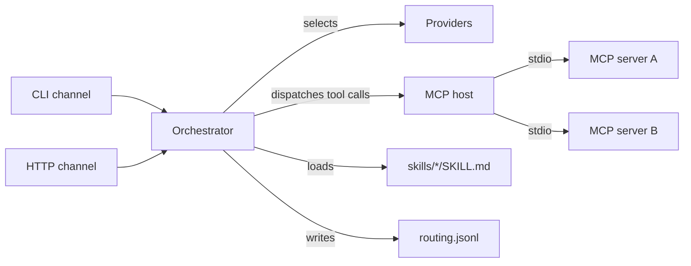

# ferryman

> A local-first MCP host with pluggable skills, multi-provider routing, and
> multi-channel I/O. The gateway, not the IDE.

[](.github/workflows/ci.yml)
[](LICENSE)
[](https://kotlinlang.org)

ferryman sits one level above Claude Code: instead of being the IDE, it is the
gateway that connects MCP servers, routes requests across LLM providers, and
exposes skills (the [Agent Skills](https://agentskills.io) open standard) over
multiple channels (CLI and HTTP). It is a small, honest, well-architected
gateway — a portfolio piece, not a product.

## Feature status

Every row maps to a runnable command. Nothing is marked `done` until that
command passes on `main`.

| Capability | Status | Proof command |
|---|---|---|
| Build, lint, test | done | `./gradlew build` (28 tests, ktlint, detekt — green) |
| CLI launcher | done | `./gradlew installDist` → `build/install/ferry/bin/ferry` |
| Provider routing (≥2 providers) | done | `ferry providers list` (prints anthropic + zai-glm as JSON) |
| Skills enumerable | done | `ferry skills list` (scans `ferryman/skills/*/SKILL.md`) |
| MCP host aggregates tools | building | `ferry tools list` (needs a runnable stdio MCP server) |
| Skill runs end to end | building | `ferry run hello-repo --input "..."` (needs an API key env var) |
| HTTP channel | building | `ferry serve --port 8080` (needs an API key env var) |
| Routing logged | done | unit-tested; `logs/routing.jsonl` written by every `runSkill` call |
| Python eval harness | building | `python -m pytest eval_harness/ -q` (15 rule-scorer tests green; golden set awaits human sign-off) |

## Quickstart

```bash
git clone <repo> && cd <repo>
export ANTHROPIC_API_KEY=...   # optional: enables the anthropic provider
export ZAI_API_KEY=...         # enables the default zai-glm provider
./gradlew build
./gradlew installDist
./build/install/ferry/bin/ferry providers list
./build/install/ferry/bin/ferry skills list
./build/install/ferry/bin/ferry run hello-repo --input "summarize this repo"
```

## Architecture



- **Channels** (`channels/`) — CLI and HTTP both call the same `Orchestrator`.
- **Orchestrator** (`orchestrator/`) — `runSkill(name, input)`: loads the skill,
  selects a provider, runs the model↔tool loop, writes a routing log line.
- **Providers** (`providers/`) — `LlmProvider` with `AnthropicProvider` and
  `OpenAiCompatibleProvider` (covers z.ai GLM, OpenRouter, Ollama, vLLM, …).
- **MCP host** (`host/`) — connects stdio servers, aggregates tools into a
  namespaced registry (`<server>.<tool>`).
- **Skills** (`skills/`) — scans `skills/*/SKILL.md` (Agent Skills open standard).
- **Config** (`config/`) — a single TOML file; the Python eval harness reads it
  with stdlib `tomllib`.

See `AGENTS.md` for the package map and contribution rules.

## Roadmap (not yet built)

- Streamable HTTP transport for the MCP host (stdio only for now).
- More channels: Telegram, Slack (HTTP is the MVP second channel).
- More providers: via koog graduation path (`ai.koog:koog-agents`) if the thin
  abstraction outlives its usefulness.
- The eval harness and scorecard under `eval_harness/`.

## License

Apache-2.0. See [LICENSE](LICENSE).
