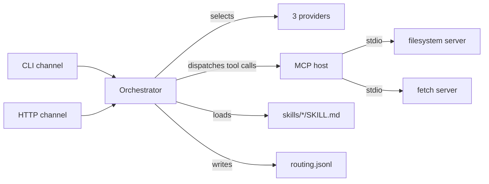

# ferryman

> A local-first MCP host with pluggable skills, multi-provider routing, and
> multi-channel I/O. The gateway, not the IDE.

[](.github/workflows/ci.yml)
[](LICENSE)
[](https://kotlinlang.org)

ferryman sits one level above Claude Code: instead of being the IDE, it is the
gateway that connects MCP servers, routes requests across LLM providers, and
exposes skills (the [Agent Skills](https://agentskills.io) open standard) over
multiple channels (CLI and HTTP). It is a small, honest, well-architected
gateway — a portfolio piece, not a product.

> **Host, not server.** ferryman is an MCP *host*: it connects **to** MCP
> servers (filesystem, fetch) as a client and aggregates their tools. It does
> not expose itself **as** an MCP server — you cannot point an LLM's MCP config
> at it and discover tools. An LLM reaches ferryman through its own channels
> instead: shell out to `ferry run <skill>`, or `POST /invoke` against
> `ferry serve`. (Exposing ferryman-as-server is a real gap, not a config flag.)

## Get a fit summary for a role

The primary use case: research a company's engineering fit for a mobile-engineer
candidate. Give it a company and a role, and ferryman fetches real data from the
web and reports on tech stack, remote policy, AI posture, and mobile-first
orientation — with sources cited.

```bash
git clone https://github.com/ber4444/ferryman-mcp && cd ferryman-mcp
./gradlew build && ./gradlew installDist

export ZAI_API_KEY=...        # or GEMINI_API_KEY=... or DEEPINFRA_API_KEY=...

./build/install/ferry/bin/ferry run company-role-research \
  --input '{"company":"EarnIn","role":"Senior Mobile Engineer (Android)"}'
```

Output (abbreviated):

```
**Tech stack:** EarnIn's Android app uses Jetpack Compose and Kotlin
Multiplatform for shared logic (per their engineering blog).
**Remote policy:** Remote-friendly for mobile engineers.
**SF Bay Area:** HQ in Palo Alto; hybrid optional.
**AI posture:** Not AI-native — fintech/earnings-access product.
**Mobile-first:** Yes — mobile is the primary product surface.
**Sources:** https://earnin.com/careers, https://earnin.com/eng/blog
```

Switch providers to compare:

```bash
# Same query, different model — routes through Gemini instead of z.ai GLM
./build/install/ferry/bin/ferry run company-role-research \
  --provider gemini \
  --input '{"company":"EarnIn","role":"Senior Mobile Engineer (Android)"}'
```

## Feature status

Every row maps to a runnable command. Nothing is marked `done` until that
command passes on `main`.

| Capability | Status | Proof command |
|---|---|---|
| Build, lint, test | done | `./gradlew build` (31 Kotlin tests, ktlint, detekt) |
| CLI launcher | done | `./gradlew installDist` → `build/install/ferry/bin/ferry` |
| Provider routing (3 providers) | done | `ferry providers list` — zai-glm, gemini, hf-llama |
| Skills enumerable | done | `ferry skills list` — company-role-research, hello-repo, chess-opening-coach |
| MCP host aggregates tools | done | `ferry tools list` — filesystem + fetch MCP servers |
| Fit summary | done | `ferry run company-role-research --input '{"company":"...","role":"..."}'` |
| HTTP channel | building | `ferry serve --port 8080` (needs an API key) |
| Routing logged | done | unit-tested; `logs/routing.jsonl` written by every `runSkill` call |
| Python eval harness | done | `python -m pytest eval_harness/ -q` (133 tests green) |
| Multi-provider scorecard | done | 144 rows (48×3), all three providers scored — see [Scorecard status](#scorecard-status) |
| Multi-skill harness (`--skill`) | done | `python eval_harness/run_scorecard.py --skill chess-opening-coach` |
| Chess eval (objective exact-match) | done | `python -m pytest eval_harness/tests/test_chess_scorers.py -q` — see [Chess eval status](#chess-eval-status) |
| Deterministic readability axis | done | `python -m pytest eval_harness/tests/test_chess_scorers.py -k readability -q` (5 tests) |
| Scoring on-device runs ferryman didn't generate | done | `python eval_harness/score_move_coach_run.py <results.jsonl> <candidates.json>` — see [On-device runs](#on-device-runs) |

## Scorecard status

The full matrix ran (2026-07-16): 144 rows, the 48-case golden set × 3
providers. **All three providers produced real research output with zero errors
— the first clean three-provider run.** Gemini finally scored after switching to
`gemini-3.1-flash-lite` (prior models `gemini-3.5-flash`/`-flash-lite` returned
503s or don't exist; `2.5-flash-lite` is deprecated).

| Provider | Rule pass | Output / errors | Mean latency | Mean cost |
|---|---|---|---|---|
| hf-llama | **82%** | 48 / 48, 0 errors | 10.4 s | $0.0002 |
| gemini | **76%** | 48 / 48, 0 errors | 6.0 s | $0.0004 |
| zai-glm | **68%** | 48 / 48, 0 errors | 18.2 s | $0.0011 |

**What this shows.** Three model families (Llama 70B, Gemini Flash-Lite, GLM
Turbo) score within ~14 points of each other on the same skill — the
multi-provider routing claim is now a *measured* result, not a config option.
hf-llama leads on quality at the lowest cost; gemini is fastest; zai-glm scores
lowest on this run but was the prior leader under `glm-5.2` (74%), so the model
swap to the cheaper `glm-5-turbo` traded some accuracy for cost/speed.

**Cost is exact** — the Kotlin provider parses the `usage` block and threads
real token counts through to `estimate_cost` (token-propagation landed in
commit `e507414`). This run used that build, so cost reflects actual usage
rather than the chars÷4 fallback.

**How this run happened.** Earlier runs died on a single gemini timeout and
saved nothing; robustness fixes (per-case isolation, incremental writes,
provider ordering llama→zai→gemini, timeout retry) let this run complete all 144
rows. The negation-aware scorer fix is applied — these are the corrected numbers.

**Scorer bug, fixed earlier.** The positive-presence scorers matched the concept
word anywhere in the output, so *"No public evidence of Jetpack Compose"*
counted as a pass for `usesJetpackCompose`. `_positive_presence` is now
negation-aware (a match preceded by "no evidence of…" no longer counts). The bug
inflated every provider whose output honestly declines; it punished the most
honest model hardest.

## Chess eval status

A second skill — `chess-opening-coach` — is evaluated against an **objective,
exact-match** golden set, a stricter floor than the company-research harness's
positive-presence + citation checks. This is the "deeper methodology" the
chess-app repo's eval article points at this companion repo for: the chess app's
own golden set is rule-based concept-substring scoring (owner-must-verify
candidates); here the same position-evaluation task is scored against published
answer keys with no judge in the loop for the floor.

**The golden set is a vendored subset of [ChessQA](https://github.com/CSSLab/chessqa-benchmark)**
(CSSLab, MIT — see `eval_harness/golden/CHESS_GOLDEN_LICENSE.txt`). 40
stratified cases: 20 Short Tactics (best-move in UCI, across beginner→expert
rating buckets) + 20 Position Judgment (centipawn-band estimation, across all
five eval bands). The scorer ports ChessQA's `FINAL ANSWER:` extraction contract
verbatim so its scoring matches the published methodology.

**Two scoring axes, kept distinct** (never collapsed into one number):

1. **Objective floor (rule layer):** `FINAL ANSWER:` is extracted and exact-
   matched against the case's `correctAnswer` — UCI move normalization for
   tactics, centipawn-band string match for position judgment. No judge, no
   fuzziness. Three deterministic scorers run alongside it: a **forbidden-phrase**
   gate (ported from the chess app's validators) fails any output asserting engine
   depth/ELO/unsupported certainty; **reason-faithfulness** checks the explanation
   against the move's derived tags, on UCI cases (they are the ones with a move,
   and so a tag set, to be faithful to); and **readability** bounds the reading
   level of the coaching prose.
2. **Coaching-quality (judge layer):** the existing family-excluded LLM judge,
   scored against a chess-specific rubric (`eval_harness/rubric-chess.md`).

**Why readability is a rule and not a judge criterion.** The judge's
`tone_and_structure` passed **120/120** on this skill — and the raw scores show a
criterion whose *floor* sits exactly on the pass bar (`{3.0: 57, 4.0: 12, 5.0: 51}`)
while every other criterion emits 1s and 2s. A criterion that has never failed has
not been tested. `score_readability` replaces it with Flesch-Kincaid over the prose,
after stripping `<think>` deliberation and the `FINAL ANSWER:` line (a protocol
token, not prose — counting it as a sentence flatters the score). An output carrying
only the marker reports *"no coaching prose"* rather than passing by default.

Two things to know before touching the bound. **8.0 is chosen for discrimination,
not correctness** — it separates hf-llama at roughly twice the others, which agrees
independently with its worst-in-set rule pass rate, reasoning quality and factual
correctness; above ~9.5 the separation collapses and inverts, and at 12.0 nothing
fails and the column is decorative. And **the grades are ordinal, not real US grade
levels**: the syllable counter is a heuristic, and it only works because the same
function both sets the bound and checks against it, so the bias cancels. An absolute
figure needs CMUdict and a recalibration.

The chess app's own tone rules were tried here first and **two of the three are inert
on this corpus** — `no_person_praise` never fires in 91 outputs, and
`criticism_has_next_step` passes almost without firing because criticism vocabulary
appears in 1 of 91. They discriminate in the app, where the coach critiques the
player's *own* move. A scorer is only meaningful relative to the corpus it runs on.

```bash
python eval_harness/run_scorecard.py --skill chess-opening-coach --all-providers
```

**Honesty note — bootstrap vs canonical.** The ChessQA subset is a *bootstrap*
set: templated, MIT-licensed, objective, runnable today. It is not the
engine-grounded canonical set. The canonical follow-on — a Lichess→Stockfish
curation pipeline that samples positions, re-analyzes each at a fixed engine
config, derives move-quality labels from eval deltas, stratifies, and
human-reviews + freezes the set — is specced in
[`docs/plans/chess-lichess-curation.md`](docs/plans/chess-lichess-curation.md)
(not yet built). No scorecard numbers are committed until a real run produces
them.

### On-device runs

ferryman is an HTTP-only MCP host with no on-device provider, and the generators
worth measuring — LiteRT-LM, ML Kit/AICore — live inside the chess app. But the
scorers here are provider-agnostic: they check a string of prose against a tag
set. So generation and scoring are decoupled. The app writes a file, ferryman
scores it, and a model that ferryman cannot call is still scored by the same
rules as any cloud provider.

| Script | Input | What it answers |
|---|---|---|
| `score_litert_outputs.py` | `litert-outputs.json` (`EvalLiteRtDriver.kt`) | Does LiteRT-LM's paraphrase stay faithful to the deterministic tags? |
| `score_move_coach_run.py` | `results.jsonl` (`AndroidBenchRunner`) | Does the on-device Move Coach beat the deterministic sentence in the same row? |
| `judge_move_coach_run.py` | the same `results.jsonl` | The judge layer for the above — needs `JUDGE_API_KEY`. |

```bash
# Rule layer — no key, no network
python eval_harness/score_move_coach_run.py results.jsonl evals/golden/candidates.json

# Judge layer — blinded pairwise preference + a separate veto pass
JUDGE_BASE_URL=https://api.deepinfra.com/v1/openai \
JUDGE_MODEL=deepseek-ai/DeepSeek-V4-Flash \
python eval_harness/judge_move_coach_run.py results.jsonl
```

The Move Coach run carries **two candidates per row** — the model's answer and
the deterministic sentence that was in the model's own prompt. That makes the
product question directly scorable: not "does the model pass a gate" but "does
it beat the free, instant sentence it was handed".

**Three things this measurement taught, all of them about the harness:**

- **Coverage does not transfer to every surface.** `_check_faithfulness` folds
  two checks together, and only the invention half applies to a two-sentence
  panel handed five tags. Coverage failed 99/100 for the *shipping* deterministic
  line — a statement about the rule, not the product. `check_invention` is now
  callable on its own; the folded verdict returned coverage first and so hid one
  column's inventions entirely.
- **A vocabulary entry is a measurement instrument.** `capture` held bare `win`,
  which matches "your winning chances"; `mate` matched inside "material". Every
  capture and checkmate flag in a 100-row run came from those two substrings and
  none was real.
- **A control that only tests identity is not a control.** The judge's veto
  scored 0/100 on the deterministic column — but that text appears verbatim in
  the veto prompt's ground truth, so the zero proves only that the judge
  recognises identity, never that it tolerates paraphrase. Hand-verifying 12 of
  its 81 flags on the model column found 1 real. A trustworthy veto needs a
  known-good *paraphrase* as its control; that is not built yet.

Judge models are compared on that control before use, not chosen by reputation:
on the same rows, false positives on the deterministic column were 5/12 for
Llama-3.1-70B, 3/11 for gpt-oss-120b, and 0/12 for DeepSeek-V4-Flash.

## Quickstart

```bash
git clone https://github.com/ber4444/ferryman-mcp && cd ferryman-mcp

# Build the host and CLI
./gradlew build
./gradlew installDist

# Set at least one provider key (all optional, but you need one to run a skill)
export ZAI_API_KEY=...         # z.ai GLM (default provider)
export GEMINI_API_KEY=...      # Google Gemini
export DEEPINFRA_API_KEY=...   # DeepInfra (Llama 3.1 70B)

# List configured providers and skills
./build/install/ferry/bin/ferry providers list
./build/install/ferry/bin/ferry skills list

# Get a fit summary for a role
./build/install/ferry/bin/ferry run company-role-research \
  --input '{"company":"EarnIn","role":"Senior Mobile Engineer (Android)"}'
```

## Running the eval harness

The harness scores the `company-role-research` skill against a 48-case golden set
(real companies + a fabricated "Acme Holdings" negative case). It supports two
invocation modes:

**Via subprocess (finds the Gradle-installed binary automatically):**

```bash
python3 -m venv .venv && source .venv/bin/activate
pip install -e '.[dev]'
python eval_harness/run_scorecard.py --all-providers
```

**Via HTTP (start the server first, then point the harness at it):**

```bash
# Terminal 1 — start the ferry HTTP channel
./build/install/ferry/bin/ferry serve --port 8080 &

# Terminal 2 — run the scorecard (auto-detects HTTP, falls back to subprocess)
python eval_harness/run_scorecard.py --all-providers
```

The scorecard writes `eval_harness/scorecard.md` (human-readable) and
`eval_harness/scorecard.json` (machine-readable) with real numbers from real
invocations — no fabricated results.

To run the judge layer (requires a separate `JUDGE_API_KEY`):

```bash
# Defaults to OpenAI gpt-4o-mini — family `gpt` has no overlap with the
# evaluated providers (glm/gemini/meta), so family-exclusion skips no rows.
JUDGE_API_KEY=... python eval_harness/run_scorecard.py --all-providers --judge
```

The judge defaults to OpenAI `gpt-4o-mini` at `https://api.openai.com/v1`.
Override `JUDGE_BASE_URL` / `JUDGE_MODEL` to use any other OpenAI-compatible
endpoint — but note the family-exclusion rule: a judge never grades its own
family, so picking a GLM/Gemini/Llama judge would skip those providers' rows.

### Troubleshooting

- **`McpException: Connection closed`** — an MCP server failed to start. The
  `fetch` server requires `mcp-server-fetch` installed in the `.venv`
  (`pip install -e .` pulls it in as a dependency). Run `ferry tools list` to
  verify both servers start cleanly.
- **`No provider available for skill`** — no API key is set for any provider.
  Export at least one of `ZAI_API_KEY`, `GEMINI_API_KEY`, or
  `DEEPINFRA_API_KEY`, then check with `ferry providers list` (look for
  `"apiKeySet": true`).
- **`Reached tool-call limit`** — the model looped without converging. Ensure
  the fetch MCP server is running (check `ferry tools list`).
- **`Neither HTTP channel nor ferry binary available`** — the harness couldn't
  find ferry. Either run `./gradlew installDist` first (the harness checks
  `build/install/ferry/bin/ferry` automatically), or set `FERRY_BINARY` to the
  full path.

## Architecture


```mermaid
flowchart LR
    CLI[CLI channel] --> Orchestrator
    HTTP[HTTP channel] --> Orchestrator
    Orchestrator -->|selects| Providers[3 providers]
    Orchestrator -->|dispatches tool calls| McpHost[MCP host]
    McpHost -->|stdio| FS[filesystem server]
    McpHost -->|stdio| Fetch[fetch server]
    Orchestrator -->|loads| Skills[skills/*/SKILL.md]
    Orchestrator -->|writes| Logs[routing.jsonl]
```

- **Channels** (`channels/`) — CLI and HTTP both call the same `Orchestrator`.
- **Orchestrator** (`orchestrator/`) — `runSkill(name, input)`: loads the skill,
  selects a provider, runs the model↔tool loop, writes a routing log line.
- **Providers** (`providers/`) — `LlmProvider` with `OpenAiCompatibleProvider`
  (covers z.ai GLM, Gemini, DeepInfra, OpenRouter, Ollama, vLLM, …). All
  configured providers route through the same abstraction. Retries 429/503,
  timeouts, and connection errors with backoff (up to 3 attempts). Parses the
  `usage` block so token counts (and thus cost) are real, not estimated.
- **MCP host** (`host/`) — connects stdio servers, aggregates tools into a
  namespaced registry (`<server>.<tool>`). Two servers configured: filesystem
  (`@modelcontextprotocol/server-filesystem`) and fetch (`mcp-server-fetch`).
- **Skills** (`skills/`) — scans `skills/*/SKILL.md` (Agent Skills open
  standard). Three skills: `company-role-research` (fit summaries + eval
  target), `hello-repo` (repo summarizer), and `chess-opening-coach`
  (position coaching + chess eval target).
- **Config** (`config/`) — a single TOML file; the Python eval harness reads it
  with stdlib `tomllib` to enumerate providers for the `--all-providers` matrix.
- **Eval harness** (`eval_harness/`) — Python package with rule-based scorers
  (8 deterministic checks), an LLM-as-judge scorer (5-criterion rubric with
  family-exclusion), and a multi-provider scorecard runner. See
  `eval_harness/README.md` for details.

See `AGENTS.md` for the package map and contribution rules.

## Providers

| Provider | Model | Type | Pricing (per 1M tokens) |
|---|---|---|---|
| zai-glm (default) | glm-5-turbo | openai-compatible | $1.20 in / $4.00 out |
| gemini | gemini-3.1-flash-lite | openai-compatible | $0.25 in / $1.50 out |
| hf-llama | Meta-Llama-3.1-70B-Instruct-Turbo | openai-compatible (DeepInfra) | $0.59 in / $0.79 out |

Adding an OpenAI-compatible provider is a config-only change — edit
`ferryman/config.toml`, no code needed.

## Roadmap (not yet built)

- Streamable HTTP transport for the MCP host (stdio only for now).
- More channels: Telegram, Slack (HTTP is the MVP second channel).

## License

Apache-2.0. See [LICENSE](LICENSE).
